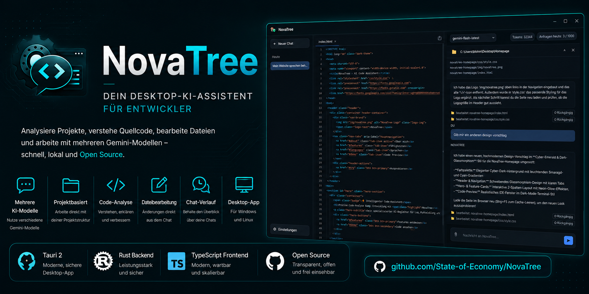

# NovaTree

**🇩🇪 [Deutsch](#deutsch) | 🇬🇧 [English](#english)**

---

<a name="deutsch"></a>

## 🇩🇪 Deutsch

Desktop-Chat-Client (Windows/Linux) für die Google Gemini API, gebaut mit [Tauri](https://tauri.app) 2
(Rust-Backend + Vanilla TypeScript-Frontend).

**Inhalt:** [Features](#de-features) · [Entwicklung](#de-entwicklung) ·
[Release via GitHub Actions](#de-release) · [Bekannte Linux-Probleme](#de-linux-probleme) ·
[API-Schlüssel einrichten](#de-api-key) · [CLI](#de-cli) · [Lizenz](#de-lizenz)

---

### ⚠️ WICHTIGER RECHTLICHER HINWEIS / DISCLAIMER

Diese Software wird "wie besehen" (AS IS) und ohne jegliche Gewährleistung oder Garantie bereitgestellt. Da NovaTree im "Workspace-Modus" autonom Dateien auf Ihrer Festplatte erstellen, bearbeiten oder löschen kann, erfolgt die Nutzung komplett auf eigene Gefahr. Die Entwickler übernehmen keinerlei Haftung für Datenverlust, Systemschäden, Fehlfunktionen oder daraus resultierende Folgeschäden. Mit der Nutzung der App erklären Sie sich mit diesem Haftungsausschluss einverstanden.

---

> **Hinweis (v0.6.0):** Die App hieß bis v0.5.1 „NovaTwin" und wurde aus Markenrechtsgründen in
> „NovaTree" umbenannt (App-Identifier, Repo, Datenablage). Wer eine ältere Version installiert
> hatte: Chats/Einstellungen werden **nicht automatisch übernommen** (neue App-ID = neuer
> Datenpfad) und der Google-API-Schlüssel muss einmalig neu in den Einstellungen eingetragen
> werden (neuer Schlüsselbund-Eintrag).

> [!IMPORTANT]
> **🛡️ Wichtiger Hinweis für Windows-Nutzer ("Computer wurde geschützt"):**
> <br>Da NovaTree ein unabhängiges Open-Source-Projekt ist und nicht kostenpflichtig digital signiert wurde, zeigt Windows SmartScreen beim ersten Start die Warnung *"Der Computer wurde durch Windows geschützt"* an.
>
> Die App ist zu 100 % sicher! Du kannst die Meldung einfach überspringen:
> 1. Klicke im blauen Fenster auf **"Weitere Informationen"**.
> 2. Klicke unten rechts auf den Button **"Trotzdem ausführen"**.
>
> Da der gesamte Quellcode hier offenliegt, kann sich jeder selbst davon überzeugen, dass keine Schadsoftware enthalten ist. Sobald genügend Nutzer die App starten, lernt Windows automatisch, dass sie sicher ist, und die Meldung verschwindet von selbst!

<a name="de-features"></a>

### Features

- Eigene, ins Design integrierte Titelleiste (keine native OS-Titelleiste) mit Versionsanzeige
- Sidebar mit Chat-Verlauf, "Neuer Chat"-Button und Einstellungen
- Modell-Auswahl pro Chat (`gemini-flash-latest`, `gemini-3.1-flash-lite`; `gemini-2.5-pro` ist im
  Free Tier ausgegraut, da Google dafür Kontingent 0 vergibt)
- Token- und Tageskontingent-Anzeige (Free-Tier-Limit: 1000 Anfragen/Tag, 15/Minute). Bei
  HTTP-429-Antworten (Quota exceeded) weicht die App zuerst automatisch auf ein anderes Modell aus
  (Free-Tier-Kontingente sind pro Modell getrennt) - erst wenn dabei ebenfalls alle Modelle ihr
  Kontingent aufgebraucht haben, greift ein Cooldown-Timer. Kam eine Antwort auf diese Weise von
  einem anderen als dem gewählten Modell, markiert ein kleines „⚡"-Badge an der Nachricht das
  sichtbar (ab v0.8.10)
- Datei-Anhang (Büroklammer) zum Einlesen lokaler Dateien (z. B. `.lua`, `.py`) als Kontext
- "Datei aktualisieren"-Button, um von Gemini editierten Code direkt auf die Festplatte zurückzuschreiben
- **Workspace-Ordner pro Chat**: lokalen Projektordner verknüpfen, Gemini sieht die vorhandene
  Dateistruktur und kann per striktem JSON-Protokoll autonom Dateien darin erstellen, bearbeiten
  oder löschen (siehe unten)
- API-Schlüssel wird **nicht** im Code oder als Klartext gespeichert, sondern im
  OS-Schlüsselbund (Windows Credential Manager / Linux Secret Service via `keyring`-Crate)
- Automatisches Update: Beim Start prüft die App den neuesten GitHub-Release; ist eine neuere,
  signierte Version verfügbar, erscheint ein Banner zum Herunterladen/Installieren + Neustart

#### Workspace-Ordner

Über das 📁-Icon im Chat-Header lässt sich pro Chat ein lokaler Ordner verknüpfen. Vor jeder
Anfrage liest die App die aktuelle Dateiliste des Ordners rekursiv und hängt sie an den
System-Prompt an. Dabei wird die `.gitignore` des Projekts (inkl. `.git/info/exclude` und
globaler Gitignore-Regeln) beachtet – über die `ignore`-Crate, dieselbe Bibliothek, die auch
`ripgrep` nutzt. Versteckte Dateien/Ordner sowie `node_modules`/`target`/`dist`/`venv`/
`__pycache__` werden zusätzlich immer übersprungen, auch ohne `.gitignore`. So landen z. B.
`.env`-Dateien mit echten Zugangsdaten nicht versehentlich im an Gemini gesendeten Kontext.

Zusätzlich wird - auf jeder Verzeichnisebene, wie `.gitignore` selbst - eine `.novatreeignore`
(gleiche Syntax) beachtet. Damit lassen sich Dateien ausschließen, die zwar in Git getrackt sind,
aber für die KI trotzdem irrelevant oder unnötig groß sind (z. B. große Testdaten, generierte
Bundles, Lockfiles), ohne die eigentliche `.gitignore` dafür anzufassen.

Antwortet Gemini mit einem JSON-Objekt der Form

```json
{ "action": "create|edit|delete", "filename": "relativer/pfad.lua", "content": "…" }
```

führt die App die Aktion direkt über eigene Rust-Commands aus (kein `tauri-plugin-fs` mit
`scope: ["**"]` nötig) und zeigt statt des Roh-JSON eine kurze Statuszeile an. Dateinamen mit
`..`-Traversal oder absoluten Pfaden werden serverseitig abgelehnt, sodass Aktionen nicht aus
dem gewählten Ordner ausbrechen können.

#### KI-Dateizugriff (Freigabe-Modi)

Unter Einstellungen → **„KI-Dateizugriff"** lässt sich steuern, ob NovaTree Datei-Aktionen im
Workspace-Ordner sofort ausführt oder erst deine Bestätigung braucht:

- **Immer nachfragen** – jede Aktion (create/edit/delete) muss bestätigt werden.
- **Teil-Autonom** – einzeln pro Aktionstyp konfigurierbar (Standard: Erstellen automatisch,
  Bearbeiten/Löschen mit Nachfrage).
- **Voll-Autonom** – NovaTree schreibt ohne Rückfrage direkt durch.

Bei **Löschen** erscheint eine rote Warnung mit Dateipfad, bei **Erstellen/Bearbeiten** ein
Diff-Ansicht (Monacos nativer `createDiffEditor()`) zwischen aktuellem und vorgeschlagenem
Inhalt, in einem eigenständigen Modal – unabhängig davon, ob der Live-Editor gerade sichtbar ist.

#### Automatisches Backup (ab v0.8.4)

Jede Datei im Workspace-Ordner, die überschrieben, bearbeitet oder gelöscht wird – egal ob durch
die KI oder durch dich selbst im Live-Editor (Speichern-Button/Strg+S) – wird vorher automatisch
in einen versteckten Ordner `.novatree-backups/<relativer Pfad>/<Zeitstempel>` gesichert, ganz
ohne Git. Dieser Ordner taucht weder in der Dateiliste der App noch im an Gemini gesendeten
Workspace-Kontext auf (Ordner mit führendem `.` werden dort grundsätzlich übersprungen). Pro Datei
werden die letzten 20 Versionen aufbewahrt, ältere werden automatisch entfernt, sobald eine neue
hinzukommt – kein manuelles Aufräumen nötig.

Bei jeder erfolgreichen Datei-Aktion der KI im Chat gibt es zusätzlich einen **„↺ Rückgängig"**-
Button, der genau diese eine Änderung zurücksetzt (stellt die Version davor wieder her, bei neu
erstellten Dateien wird die Datei einfach wieder gelöscht). **Das ersetzt kein eigenes Backup/
Git-Repo** (die Sicherungen liegen weiterhin auf derselben Festplatte), ist aber ein zusätzliches
Sicherheitsnetz gegen versehentlichen Datenverlust im autonomen Modus.

#### Fuzzy-Match-Vorschlag bei fehlgeschlagenen Edits (ab v0.8.9)

Findet ein präziser Edit (`search`/`replace`) seinen `search`-Text auch nach Whitespace-
Normalisierung nicht exakt, sucht NovaTree zusätzlich nach der ähnlichsten Zeilen-Passage in der
Datei. Wird eine gefunden, erscheint direkt im Chat ein **„Meintest du diese Stelle?"**-Kasten mit
der tatsächlichen Fundstelle (Zeilennummer + Originaltext) und einem „Änderung anwenden"-Button –
ein Klick genügt, ohne dass Gemini erneut gefragt werden muss.

#### Verlauf einfrieren (ab v0.8.9)

Über das 🔒-Symbol, das beim Hovern über eine Nachricht erscheint, lässt sich der Chat-Verlauf ab
diesem Punkt "einfrieren": Alles davor bleibt sichtbar, wird aber ab sofort nicht mehr mit an
Gemini gesendet – nützlich, um lange Architektur-Diskussionen im selben Chat abzuschneiden, ohne
die Historie zu verlieren oder einen neuen Chat starten zu müssen. Eine gestrichelte Trennlinie
mit „Auftauen"-Button markiert den eingefrorenen Bereich.

#### Konflikt-Erkennung im Live-Editor (ab v0.8.11)

Schreibt die KI eine Datei, die gerade als aktiver Tab im Live-Editor mit ungespeicherten
Änderungen geöffnet ist, wird nicht mehr blind überschrieben. Stattdessen erscheint eine
Diff-Ansicht mit deiner ungespeicherten Version gegen die neue KI-Version – du entscheidest, ob
deine Änderung erhalten bleibt (wird zurück auf die Festplatte geschrieben) oder die KI-Version
übernommen wird (deine lokalen Änderungen verwerfen).

#### Präzise Bearbeitung, Architect Mode, Bild-Anhänge (ab v0.8.0)

- **Präzise Edits:** Bestehende Dateien werden nicht mehr komplett überschrieben, sondern per
  Suchen/Ersetzen-Paaren geändert (`{"search": "...", "replace": "..."}`). Trifft ein `search`
  nur nach Whitespace-Normalisierung oder gar nicht, wird nichts geschrieben und stattdessen ein
  Hinweis angezeigt, statt riskant zu raten.
- **Architect Mode:** Für komplett neue Projekte/Ressourcen mit mehreren Dateien liefert Gemini
  ein `createProject`-Objekt (Zielordner + Dateien), die App legt Ordner und Dateien in einem
  Zug an – inklusive einer konsolidierten Freigabe-Ansicht (Dateiliste statt Einzel-Diffs).
- **Bild-Anhänge:** Bilder lassen sich per Strg+V oder Drag & Drop ins Chat-Eingabefeld anhängen;
  sie werden clientseitig auf max. 1024px Breite herunterskaliert und als JPEG komprimiert, bevor
  sie als Teil der Anfrage an Gemini gesendet werden.
- **JSON-Reparatur:** Wird eine Antwort mitten im JSON abgeschnitten (Ausgabe-Limit erreicht),
  versucht die App automatisch, offene Strings/Klammern zu schließen, bevor sie aufgibt – statt
  das kaputte Roh-JSON als Chat-Text anzuzeigen.

<a name="de-entwicklung"></a>

### Entwicklung

Voraussetzungen: [Node.js](https://nodejs.org), [Rust](https://www.rust-lang.org/tools/install) und die
[Tauri-Systemabhängigkeiten](https://tauri.app/start/prerequisites/) für dein Betriebssystem.

```bash
npm install
npm run tauri dev
```

### Produktions-Build (lokal)

```bash
npm run tauri build
```

<a name="de-release"></a>

### Automatischer Release via GitHub Actions

Bei jedem Push auf `main` bauen zwei Jobs in `.github/workflows/release.yml`
(`publish-tauri-linux`, danach `publish-tauri-windows`) mittels `tauri-apps/tauri-action` automatisch:

- Windows: `.exe` (NSIS) / `.msi`
- Linux: `.deb` / `.rpm`
- Zusätzlich wird die rohe Linux-ELF-Binärdatei (`NovaTree_<version>_linux_amd64`, unverpackt, ohne
  Installer) direkt mit hochgeladen – nützlich zum Debuggen (z. B. `./NovaTree_*_linux_amd64` im
  Terminal starten, um echte Fehlerausgaben zu sehen) oder für Distros ohne `.deb`/`.rpm`.
  Benötigt die gleichen System-Bibliotheken wie das `.deb`/`.rpm` (u. a. `webkit2gtk-4.1`) und
  bekommt **keine** automatischen Updates (nur die gebündelten Formate mit Signatur tun das).

Zusätzlich baut ein zweiter Job (`flatpak-bundle`) im Anschluss ein `NovaTree.flatpak` gegen die
`org.gnome.Platform`-Runtime (bringt eine feste, getestete WebKitGTK-Version mit statt der des
Host-Systems mit, was auf vielen Distros zuverlässiger läuft als eine unverpackte Binary).
Installation: `.flatpak`-Datei herunterladen, dann `flatpak install NovaTree.flatpak` bzw. per
Doppelklick, falls die Dateimanager-Integration vorhanden ist.

#### Arch Linux / AUR

Unter [`aur/novatree-bin/`](aur/novatree-bin/PKGBUILD) liegt eine `PKGBUILD` für ein AUR-Binärpaket
(installiert die rohe `NovaTree_<version>_linux_amd64`-Datei aus den Releases, kein Kompilieren
nötig). Das Paket ist noch **nicht** im AUR veröffentlicht – Schritte dafür stehen in
[`aur/README.md`](aur/README.md), erfordern aber einen persönlichen AUR-Account mit SSH-Key.

> **Hinweis:** Es gibt bewusst **kein AppImage** mehr (entfernt in v0.8.5). Tauris AppImage-Bundler
> bündelt eine eigene WebKitGTK/GTK/Wayland-Bibliothekskette, deren Startskript zudem
> bedingungslos `GDK_BACKEND=x11` erzwingt – auf manchen Wayland-Systemen (z. B. CachyOS) führte
> das trotz mehrerer Fixversuche zu einem dauerhaft weißen Fenster. Flatpak und die rohe
> ELF-Binärdatei decken denselben Anwendungsfall (portabel, kein Root nötig) zuverlässiger ab.

Die fertigen Installer werden automatisch als **veröffentlichter Release** (nicht als Draft)
unter "Releases" im Repository abgelegt – nur ein veröffentlichter Release ist über den
`/releases/latest/download/...`-Endpunkt erreichbar, den der Auto-Updater abfragt.

Vor der ersten Nutzung: Repository (und ggf. die Organisation) unter
`Settings → Actions → General → Workflow permissions` auf "Read and write permissions" stellen,
damit der Workflow Releases erstellen darf.

<details>
<summary><strong>Auto-Updater</strong> (Details ausklappen)</summary>

Die App prüft bei jedem Start `https://github.com/State-of-Economy/NovaTree/releases/latest/download/latest.json`.
Ist die dort verzeichnete Version neuer als die installierte, erscheint ein Update-Banner.
Damit ein neuer Push tatsächlich ein Update auslöst, **muss die Versionsnummer** in
`src-tauri/tauri.conf.json` (Feld `version`) und `package.json` vor dem Push erhöht werden –
sonst versucht die Pipeline, denselben Release-Tag erneut anzulegen, was fehlschlägt.

Updates werden mit einem lokal erzeugten Minisign-Schlüsselpaar signiert:

- **Public Key** liegt in `src-tauri/tauri.conf.json` (`plugins.updater.pubkey`) – öffentlich, unkritisch.
- **Private Key** liegt **nicht** im Repository, sondern als verschlüsseltes GitHub-Secret
  `TAURI_SIGNING_PRIVATE_KEY` (Passwort in `TAURI_SIGNING_PRIVATE_KEY_PASSWORD`).
  **Wichtig:** Diesen privaten Schlüssel sicher aufbewahren (z. B. Passwortmanager) – geht er
  verloren, können keine weiteren signierten Updates mehr veröffentlicht werden und bestehende
  Installationen lassen sich nicht mehr automatisch aktualisieren.

</details>

<a name="de-linux-probleme"></a>

<details>
<summary><strong>Bekannte Linux-Probleme</strong> (Details ausklappen)</summary>

**Fenster bleibt komplett weiß/schwarz:** Ein häufiger WebKitGTK-Bug auf manchen Linux-Systemen
(VMs, bestimmte Mesa/GPU-Treiber, einige Wayland-Setups). Ab v0.3.1 setzt die App automatisch
`WEBKIT_DISABLE_COMPOSITING_MODE=1` und `WEBKIT_DISABLE_DMABUF_RENDERER=1` beim Start, was das
Problem in den meisten Fällen behebt. Tritt es trotzdem noch auf, testweise manuell setzen:

```bash
WEBKIT_DISABLE_COMPOSITING_MODE=1 WEBKIT_DISABLE_DMABUF_RENDERER=1 ./NovaTree_*_linux_amd64
```

**Weißes Fenster mit "could not connect to localhost" (Flatpak oder nativ):**
WebKitGTKs eigene interne (bubblewrap-)Sandbox blockiert die localhost-Verbindung, über die Tauri
intern die App-Assets ausliefert – bzw. schlägt auf manchen Systemen (z. B. Arch/CachyOS, wo
unprivilegierte User-Namespaces standardmäßig per Kernel-Hardening deaktiviert sind) komplett fehl
und die App startet mit einer "Sandbox kann nicht deaktiviert werden"-Meldung gar nicht erst. Ab
v0.3.6 setzte das Flatpak-Manifest dafür `WEBKIT_FORCE_SANDBOX=0` – diese Variable existiert bei
WebKitGTK allerdings gar nicht und hatte nie eine Wirkung; der eigentliche Fix war vermutlich die
Runtime-Anhebung auf `org.gnome.Platform//50` in v0.3.7. Ab v0.8.2 wird stattdessen die korrekte,
offiziell dokumentierte Variable `WEBKIT_DISABLE_SANDBOX_THIS_IS_DANGEROUS=1` gesetzt – sowohl im
Flatpak-Manifest als auch direkt in der App selbst (`src-tauri/src/main.rs`).

</details>

<a name="de-api-key"></a>

### API-Schlüssel einrichten

1. App starten, unten links auf **Einstellungen** klicken.
2. Auf **„API-Schlüssel holen"** klicken – öffnet Google AI Studio im Standard-Browser.
3. Optional: System-Prompt und Sicherheitsfilter anpassen.
4. Speichern – der Schlüssel wird verschlüsselt im OS-Schlüsselbund abgelegt, niemals im Klartext
   in einer Konfigurationsdatei oder im Quellcode.

#### 💡 Tipps zur Einrichtung

- **Smarter Import:** Sobald du auf Google AI Studio einen Schlüssel generierst und kopierst,
  erkennt NovaTree ihn automatisch aus der Zwischenablage und trägt ihn direkt im
  Einstellungsfenster ein (nur während das Fenster offen ist – kein Hintergrund-Polling).
- **VPN-Problem:** Zeigt die Google-Seite „Not available in your region“, schalte für das
  Generieren des Schlüssels kurz dein VPN aus. Google blockiert Rechenzentrum-IPs von
  VPN-Anbietern sehr aggressiv, um Bot-Registrierungen zu verhindern. Nach dem Kopieren des
  Schlüssels kannst du dein VPN sofort wieder aktivieren.

<a name="de-cli"></a>

### CLI: `novatree-cli` (ab v0.8.12)

Zusätzlich zur Desktop-App gibt es ein schlankes Terminal-Tool für schnelle Fragen, ohne die
GUI zu öffnen:

```bash
novatree-cli "Wie funktioniert ein Docker-Multi-Stage-Build?"
novatree-cli -m gemini-3.1-flash-lite "Kurze Frage"
```

Nutzt denselben API-Schlüssel aus dem OS-Schlüsselbund wie die Desktop-App (kein separates Setup
nötig) und streamt die Antwort live in dein Terminal. **Bewusst reiner Ask-Modus** – kein
Workspace-/Dateizugriff über die CLI. Der Workspace-Modus mit seiner ganzen Sicherheits-UI
(Diff-Ansicht, Rückgängig, Konflikt-Erkennung) ist tief an die GUI gebunden; eine gleichwertig
sichere Terminal-Variante wäre ein deutlich größeres, eigenständiges Vorhaben.

Aktuell noch **nicht** Teil der Releases – selbst bauen mit:

```bash
cargo build --release --manifest-path src-tauri/Cargo.toml -p novatree-cli
```

<a name="de-lizenz"></a>

### Lizenz

Dieses Projekt steht unter der [GNU General Public License v3.0](LICENSE). Wer den Quellcode
kopiert oder verändert, muss sein eigenes Werk ebenfalls vollständig quelloffen und unter GPLv3
weitergeben – ein geschlossener, kommerzieller Weiterverkauf ist damit ausgeschlossen.

[⬆️ Zurück zur Sprachauswahl](#novatree)

---

<a name="english"></a>

## 🇬🇧 English

Desktop chat client (Windows/Linux) for the Google Gemini API, built with [Tauri](https://tauri.app) 2
(Rust backend + vanilla TypeScript frontend).

**Contents:** [Features](#en-features) · [Development](#en-development) ·
[Release via GitHub Actions](#en-release) · [Known Linux issues](#en-linux-issues) ·
[Setting up an API key](#en-api-key) · [CLI](#en-cli) · [License](#en-license)

---

### ⚠️ IMPORTANT LEGAL NOTICE / DISCLAIMER

This software is provided "as is" without warranty of any kind. Since NovaTree is capable of autonomously creating, editing, or deleting files on your local drive in "Workspace Mode", you use this software entirely at your own risk. The developers shall not be held liable for any data loss, system damage, malfunctions, or consequential damages. By using this app, you agree to this disclaimer.

---

> **Note (v0.6.0):** The app was called "NovaTwin" up to v0.5.1 and was renamed to "NovaTree" for
> trademark reasons (app identifier, repository, data storage). If you had an older version
> installed: chats/settings are **not carried over automatically** (new app ID = new data path)
> and the Google API key needs to be re-entered once in settings (new keychain entry).

> [!IMPORTANT]
> **🛡️ Important note for Windows users ("Windows protected your PC"):**
> <br>Since NovaTree is an independent open-source project and hasn't been paid-signed, Windows SmartScreen shows the warning *"Windows protected your PC"* on first launch.
>
> The app is 100% safe! You can simply skip the warning:
> 1. Click **"More info"** in the blue window.
> 2. Click **"Run anyway"** in the bottom right.
>
> Since the entire source code is public here, anyone can verify for themselves that it contains no malware. Once enough users have started the app, Windows automatically learns it's safe and the warning disappears on its own!

<a name="en-features"></a>

### Features

- Custom, design-integrated titlebar (no native OS titlebar) with version display
- Sidebar with chat history, "New Chat" button and settings
- Model selection per chat (`gemini-flash-latest`, `gemini-3.1-flash-lite`; `gemini-2.5-pro` is
  grayed out in the free tier, since Google grants it 0 quota there)
- Token and daily-quota display (free-tier limit: 1000 requests/day, 15/minute). On HTTP 429
  responses (quota exceeded), the app first automatically falls back to another model (free-tier
  quotas are tracked per model) - only once all models have exhausted their quota this way does a
  cooldown timer kick in. If a response came from a different model than the one selected this
  way, a small "⚡" badge on the message makes that visible (from v0.8.10)
- File attachment (paperclip) to read local files (e.g. `.lua`, `.py`) as context
- "Update file" button to write Gemini-edited code straight back to disk
- **Workspace folder per chat**: link a local project folder, Gemini sees the existing file
  structure and can autonomously create, edit, or delete files in it via a strict JSON protocol
  (see below)
- API key is **never** stored in code or as plain text, but in the OS credential store (Windows
  Credential Manager / Linux Secret Service via the `keyring` crate)
- Automatic updates: on startup the app checks the latest GitHub release; if a newer, signed
  version is available, a banner appears to download/install + restart

#### Workspace folder

The 📁 icon in the chat header lets you link a local folder per chat. Before every request, the
app recursively reads the folder's current file list and appends it to the system prompt. It
honors the project's own `.gitignore` (including `.git/info/exclude` and global gitignore rules)
via the `ignore` crate - the same library `ripgrep` uses. Hidden files/folders as well as
`node_modules`/`target`/`dist`/`venv`/`__pycache__` are also always skipped, even without a
`.gitignore`. This means `.env` files with real credentials, for example, never accidentally end
up in the context sent to Gemini.

On top of that, a `.novatreeignore` (same syntax, checked at every directory level just like
`.gitignore` itself) is also honored. This lets you exclude files that ARE tracked in git but are
still irrelevant or unnecessarily large for the AI (e.g. large test fixtures, generated bundles,
lockfiles) without touching the actual `.gitignore`.

When Gemini replies with a JSON object of the form

```json
{ "action": "create|edit|delete", "filename": "relative/path.lua", "content": "…" }
```

the app executes the action directly via its own Rust commands (no `tauri-plugin-fs` with
`scope: ["**"]` needed) and shows a short status line instead of the raw JSON. Filenames with
`..` traversal or absolute paths are rejected server-side, so actions can't escape the chosen
folder.

#### AI file access (approval modes)

Under Settings → **"AI file access"** you can control whether NovaTree executes file actions in
the workspace folder immediately or asks for your confirmation first:

- **Always ask** - every action (create/edit/delete) must be confirmed.
- **Partially autonomous** - configurable individually per action type (default: create
  automatically, edit/delete with confirmation).
- **Fully autonomous** - NovaTree writes straight through without asking.

On **delete**, a red warning with the file path appears; on **create/edit**, a diff view (Monaco's
native `createDiffEditor()`) between the current and proposed content appears in a standalone
modal - independent of whether the live editor is currently visible.

#### Automatic backup (from v0.8.4)

Every file in the workspace folder that gets overwritten, edited, or deleted - whether by the AI
or by you in the live editor (save button/Ctrl+S) - is automatically backed up beforehand into a
hidden `.novatree-backups/<relative path>/<timestamp>` folder, no Git required. This folder never
shows up in the app's file list or in the workspace context sent to Gemini (folders with a leading
`.` are always skipped there). The last 20 versions per file are kept; older ones are removed
automatically once a new one is added - no manual cleanup needed.

Every successful AI file action in the chat also gets an **"↺ Undo"** button that reverts exactly
that one change (restores the prior version, or for newly created files, simply deletes the file
again). **This doesn't replace your own backups/Git repo** (the backups still live on the same
disk), but it's an extra safety net against accidental data loss in autonomous mode.

#### Fuzzy-match suggestion for failed edits (from v0.8.9)

If a precise edit's (`search`/`replace`) `search` text doesn't match exactly even after whitespace
normalization, NovaTree also searches for the closest matching line block in the file. If one is
found, a **"Did you mean this spot?"** box appears right in the chat, with the actual location
(line number + original text) and an "Apply change" button - one click is enough, without needing
to ask Gemini again.

#### Freeze history (from v0.8.9)

The 🔒 icon that appears when hovering over a message lets you "freeze" the chat history from that
point on: everything before it stays visible but is no longer sent to Gemini going forward -
useful for cutting off long architecture discussions in the same chat without losing the history
or having to start a new chat. A dashed divider with an "Unfreeze" button marks the frozen range.

#### Conflict detection in the live editor (from v0.8.11)

If the AI writes a file that's currently open as the active tab in the live editor with unsaved
changes, it's no longer silently overwritten. Instead, a diff view appears comparing your unsaved
version against the new AI version - you decide whether your change is kept (written back to disk)
or the AI's version is applied (discarding your local changes).

#### Precise editing, Architect Mode, image attachments (from v0.8.0)

- **Precise edits:** Existing files are no longer overwritten wholesale, but changed via
  search/replace pairs (`{"search": "...", "replace": "..."}`). If a `search` only matches after
  whitespace normalization or not at all, nothing is written and a notice is shown instead of
  risky guessing.
- **Architect Mode:** For entirely new projects/resources with multiple files, Gemini provides a
  `createProject` object (target folder + files); the app creates the folder and files in one go
  - including a consolidated approval view (file list instead of individual diffs).
- **Image attachments:** Images can be attached to the chat input via Ctrl+V or drag & drop; they
  are downscaled client-side to a max width of 1024px and compressed as JPEG before being sent as
  part of the request to Gemini.
- **JSON repair:** If a response gets cut off mid-JSON (output limit reached), the app
  automatically tries to close open strings/brackets before giving up, instead of showing the
  broken raw JSON as chat text.

<a name="en-development"></a>

### Development

Prerequisites: [Node.js](https://nodejs.org), [Rust](https://www.rust-lang.org/tools/install), and the
[Tauri system dependencies](https://tauri.app/start/prerequisites/) for your operating system.

```bash
npm install
npm run tauri dev
```

### Production build (local)

```bash
npm run tauri build
```

<a name="en-release"></a>

### Automatic release via GitHub Actions

On every push to `main`, two jobs in `.github/workflows/release.yml` (`publish-tauri-linux`, then
`publish-tauri-windows`) automatically build via `tauri-apps/tauri-action`:

- Windows: `.exe` (NSIS) / `.msi`
- Linux: `.deb` / `.rpm`
- Additionally, the raw Linux ELF binary (`NovaTree_<version>_linux_amd64`, unpackaged, no
  installer) is uploaded directly - useful for debugging (e.g. running
  `./NovaTree_*_linux_amd64` in a terminal to see real error output) or for distros without
  `.deb`/`.rpm` support. Requires the same system libraries as the `.deb`/`.rpm` (among others
  `webkit2gtk-4.1`) and does **not** receive automatic updates (only the bundled, signed formats
  do).

A second job (`flatpak-bundle`) then also builds a `NovaTree.flatpak` against the
`org.gnome.Platform` runtime (bundles a fixed, tested WebKitGTK version instead of the host
system's, which is more reliable on many distros than an unpackaged binary). Installation:
download the `.flatpak` file, then `flatpak install NovaTree.flatpak`, or double-click if file
manager integration is available.

#### Arch Linux / AUR

[`aur/novatree-bin/`](aur/novatree-bin/PKGBUILD) contains a `PKGBUILD` for an AUR binary package
(installs the raw `NovaTree_<version>_linux_amd64` file from the releases, no compiling needed).
The package is **not** yet published on the AUR - steps for that are documented in
[`aur/README.md`](aur/README.md), but require a personal AUR account with an SSH key.

> **Note:** There is deliberately **no AppImage** anymore (removed in v0.8.5). Tauri's AppImage
> bundler ships its own WebKitGTK/GTK/Wayland library stack, whose startup script also
> unconditionally forces `GDK_BACKEND=x11` - on some Wayland systems (e.g. CachyOS) this caused a
> persistently blank window despite several fix attempts. Flatpak and the raw ELF binary cover the
> same use case (portable, no root needed) more reliably.

The finished installers are automatically published as a **published release** (not a draft) under
"Releases" in the repository - only a published release is reachable via the
`/releases/latest/download/...` endpoint the auto-updater queries.

Before first use: set the repository (and organization, if applicable) under
`Settings → Actions → General → Workflow permissions` to "Read and write permissions" so the
workflow is allowed to create releases.

<details>
<summary><strong>Auto-updater</strong> (expand for details)</summary>

The app checks `https://github.com/State-of-Economy/NovaTree/releases/latest/download/latest.json`
on every start. If the version listed there is newer than the installed one, an update banner
appears. For a new push to actually trigger an update, **the version number must be bumped** in
`src-tauri/tauri.conf.json` (the `version` field) and `package.json` before pushing - otherwise the
pipeline tries to recreate the same release tag, which fails.

Updates are signed with a locally generated Minisign key pair:

- **Public key** lives in `src-tauri/tauri.conf.json` (`plugins.updater.pubkey`) - public, not
  sensitive.
- **Private key** is **not** in the repository, but stored as an encrypted GitHub secret
  `TAURI_SIGNING_PRIVATE_KEY` (password in `TAURI_SIGNING_PRIVATE_KEY_PASSWORD`).
  **Important:** keep this private key safe (e.g. in a password manager) - if it's lost, no
  further signed updates can be published and existing installations can no longer update
  automatically.

</details>

<a name="en-linux-issues"></a>

<details>
<summary><strong>Known Linux issues</strong> (expand for details)</summary>

**Window stays completely blank/black:** A common WebKitGTK bug on some Linux systems (VMs,
certain Mesa/GPU driver combos, some Wayland setups). Since v0.3.1 the app automatically sets
`WEBKIT_DISABLE_COMPOSITING_MODE=1` and `WEBKIT_DISABLE_DMABUF_RENDERER=1` on startup, which fixes
the problem in most cases. If it still occurs, try setting it manually:

```bash
WEBKIT_DISABLE_COMPOSITING_MODE=1 WEBKIT_DISABLE_DMABUF_RENDERER=1 ./NovaTree_*_linux_amd64
```

**Blank window with "could not connect to localhost" (Flatpak or native):**
WebKitGTK's own internal (bubblewrap) sandbox blocks the localhost connection Tauri uses
internally to serve app assets - or, on some systems (e.g. Arch/CachyOS, where unprivileged user
namespaces are disabled by default via kernel hardening), it fails outright and the app doesn't
even start, with a "sandbox could not be disabled" message. Since v0.3.6 the Flatpak manifest set
`WEBKIT_FORCE_SANDBOX=0` for this - however, this variable doesn't actually exist in WebKitGTK and
never had any effect; the real fix was likely the runtime bump to `org.gnome.Platform//50` in
v0.3.7. Since v0.8.2, the correct, officially documented variable
`WEBKIT_DISABLE_SANDBOX_THIS_IS_DANGEROUS=1` is set instead - both in the Flatpak manifest and
directly in the app itself (`src-tauri/src/main.rs`).

</details>

<a name="en-api-key"></a>

### Setting up an API key

1. Start the app, click **Settings** in the bottom left.
2. Click **"Get API key"** - opens Google AI Studio in your default browser.
3. Optional: adjust the system prompt and safety filter.
4. Save - the key is stored encrypted in the OS credential store, never in plain text in a config
   file or in source code.

#### 💡 Setup tips

- **Smart import:** As soon as you generate and copy a key on Google AI Studio, NovaTree
  automatically detects it from the clipboard and fills it in directly in the settings window
  (only while the window is open - no background polling).
- **VPN issue:** If the Google page shows "Not available in your region", briefly turn off your
  VPN to generate the key. Google aggressively blocks datacenter IPs from VPN providers to prevent
  bot registrations. You can turn your VPN back on right after copying the key.

<a name="en-cli"></a>

### CLI: `novatree-cli` (from v0.8.12)

In addition to the desktop app, there's a lightweight terminal tool for quick questions without
opening the GUI:

```bash
novatree-cli "How does a Docker multi-stage build work?"
novatree-cli -m gemini-3.1-flash-lite "Quick question"
```

Uses the same API key from the OS credential store as the desktop app (no separate setup needed)
and streams the reply live to your terminal. **Deliberately ask-mode only** - no workspace/file
access from the CLI. The workspace mode's whole safety UI (diff view, undo, conflict detection) is
deeply tied to the GUI; an equally safe terminal equivalent would be a significantly larger,
separate undertaking.

Not yet part of the releases - build it yourself with:

```bash
cargo build --release --manifest-path src-tauri/Cargo.toml -p novatree-cli
```

<a name="en-license"></a>

### License

This project is licensed under the [GNU General Public License v3.0](LICENSE). Anyone who copies
or modifies the source code must also release their own work fully open-source under GPLv3 -
closed-source commercial resale is thereby excluded.

[⬆️ Back to language selection](#novatree)
